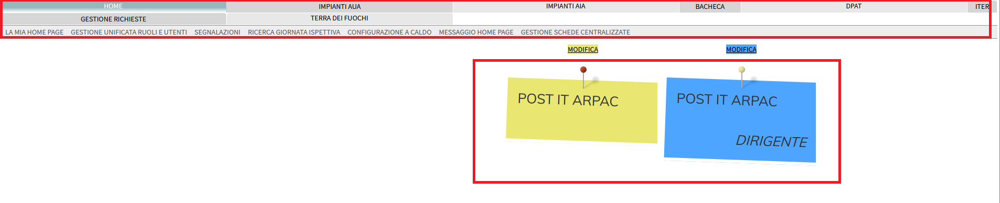
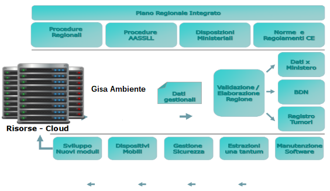

<p align="center">

</p>


# **G I S A - Gestione Informatizzata Servizi e Attività**
- [1. Descrizione e finalità del software](#1-descrizione-e-finalità-del-software)
  - [1.1 Descrizione della struttura repository](#11-descrizione-della-struttura-repository)
  - [1.2 Contesto di utilizzo e casi d’uso](#12-contesto-di-utilizzo-e-casi-duso)
  - [1.4 Piattaforme abilitanti](#14-piattaforme-abilitanti)
  - [1.5 Interoperabilità con i sistemi esterni](#15-interoperabilità-con-i-sistemi-esterni)
  - [1.6 Link a pagine istituzionali relative al progetto](#16-link-a-pagine-istituzionali-relative-al-progetto)
  - [1.7 Interfaccia web](#17-interfaccia-web)
- [2. Architettura del software](#2-architettura-del-software)
  - [2.1 Descrizione delle directory](#21-descrizione-delle-directory)
- [3. Requisiti](#3-requisiti)
  - [3.1 Tecnologie utilizzate lato server](#31-tecnologie-utilizzate-lato-server)
  - [3.2 Tecnologie utilizzate lato client](#32-tecnologie-utilizzate-lato-client)
- [4. Riuso ed installazione](#4-riuso-ed-installazione)
  - [4.1 Build dai sorgenti](#41-build-dai-sorgenti)
  - [4.2 Riuso nell’ambito della stessa regione](#42-riuso-nellambito-della-stessa-regione)
  - [4.3 Riuso per enti di altre regioni](#43-riuso-per-enti-di-altre-regioni)
  - [4.4 Librerie esterne](#44-librerie-esterne)
  - [4.5 Creazione e import database](#45-creazione-e-import-database)
  - [4.6 Templates configurazione](#46-templates-configurazione)
  - [4.7 Installazione in un ambiente di sviluppo](#47-Installazione-in-un-ambiente-di-sviluppo)
  - [4.8 Installazione in un ambiente di produzione](#48-Installazione-in-un-ambiente-di-produzione)
- [5. Configurazione](#5-configurazione)
  - [5.1 Configurazione web.xml](#51-configurazione-webxml)
  - [5.2 Configurazione datasource.xml](#52-configurazione-datasourcexml)
  - [5.3 Configurazione context.xml](#53-configurazione-contextxml)
  - [5.4 Configurazione server.xml](#54-configurazione-serverxml)
  - [5.5 Prima dell'avvio applicativo](#55-prima-dellavvio-applicativo)
- [6. Licenza](#6-licenza)
  - [6.1 Gestione Informatizzata Servizi e Attività](#61-gestione-informatizzata-servizi-e-attività)
  - [6.2 Indirizzo e-mail segnalazioni di sicurezza](#62-indirizzo-e-mail-segnalazioni-di-sicurezza)
  - [6.3 Titolarità: Regione Campania](#63-titolarità-regione-campania)


# **1. Descrizione e finalità del software** 

<p align="center">

</p>

Premessa
Il sistema nel seguito descritto, all'atto della pubblicazione su developers italia non è ancora in produzione: è in fase avanzata di sperimentazione 
ma con ancora diverse funzionalità in fase di progettazione e realizzazione.


Il sistema GISA AMBIENTE, release 1, gestisce le visite ispettive fatte dal personale
tecnico sulle anagrafiche degli impianti AIA e AUA. Vengono gestite le tre tipologie di AIA:
- Ordinaria;
- Non ordinaria.
Al sistema possono accedere tutti i tecnici GISA AMBIENTE (oltre ai Dirigenti Apicali come
il Direttore Tecnico o Generale), ciascuno per le proprie competenze, utilizzando il proprio
SPID.
Il sistema permette all'utente di ricercare un impianto con sede operativa sul territorio
regionale e di associare ad esso un fascicolo ispettivo. Ovviamente se trattasi di nuovo
impianto (non già anagrafato) sarà possibile inserirlo con tutti i dettagli relativi a:

Dati impresa (ragione sociale, partita IVA, sede legale, rappresentante legale, ecc);

Dati sede operativa (indirizzo, coordinate, ecc);

Dati IPPC;

Dati autorizzativi.

Ad ogni impianto ricercabile è possibile associare un fascicolo ispettivo ovvero una intera
visita ispettiva AIA composta da più giornate ispettive (giornate di controllo).
In ogni giornata ispettiva è possibile specificare, tra l'altro le seguenti informazioni:
- Il campo "per conto di" → ovvero la struttura per la quale la giornata ispettiva viene
eseguita;
- Il nucleo ispettivo → ovvero il gruppo ispettivo che ha seguito la specifica giornata
di controllo;
- Le tematiche controllate in quella giornata ispettiva →
- Altre componenti ambientali
- Emissioni in acqua
- Emissioni in aria
- Gestione degli incidenti e anomalie
- Materie prime e utilizzo delle risorse
- Rifiuti
- Rumore
- Sistema di gestione Ambientale
- Suolo e sottosuolo

Completato l'inserimento, dal dettaglio è possibile:
- Inserire i dati relativi ad eventuali campioni fisici prelevati (è prevista la redazione
del Verbale di Campionamento, anche esso firmato con firma grafometrica)
- Inserire eventuali non conformità.
Sempre dal dettaglio della giornata ispettiva è possibile generare il Verbale Ispettivo
precompilato. Una volta generato e firmato con firma grafometrica (sia per il responsabile
impianto che per il gruppo ispettivo), viene inviato al documentale sicr@web per la
protocollazione.
Completato il fascicolo ispettivo è possibile chiuderlo:
- Contestualmente alla chiusura, specificando il numero di protocollo della relazione
finale associata, questa verrà automaticamente recuperata dal protocollo
sicr@web, mediante cooperazione applicativa.
In GISA AMBIENTE release 1 è disponibile anche un modulo di integrazione con alcune
delle cartografie rese disponibili dal sistema di Regione Campania “i.Ter” (risorse rese
disponibili dalla versione 2.0 in produzione alla data di redazione del presente documento
 è ancora in fase di rilascio la ver.3.0 che ne amplierà e potenzierà le funzionalità e con
cui ci si integrerà in futuro).

La release 2 su Ambiente, invece, comprende la gestione della Terra dei fuochi:
- Gestione Terra dei fuochi - inserimento aree
- Particelle 
- Campionamento

NOTA SU FIRMA GRAFOMETRICA
Il sistema è interamente basato su componenti e librerie open source. 
Le sole operazioni di firma sono state implementate utilizzando software proprietario (Namirial Firmacerta SDK) che in quanto non disponibile come open source,  non è in riuso. 


## **1.1 Descrizione della struttura repository**

-  _./database_ script sql per la creazione della struttura del DB

-  _./docs_ documentazione varia (cartella contenente file integrati nel readme: immagini, diagrammi, ecc.) 

-  _./lib_ librerie esterne (nel caso di librerie di terze parti conformi alla licenza AGPL 3)

-  _./templates_ file template per la configurazione del sistema

-  _./gisarpac_ sorgenti e struttura di cartelle della piattaforma
 
## **1.2 Contesto di utilizzo e casi d’uso**

Il contesto di utilizzo e casi d'uso del software sono descritti dettagliatamente nella [***Guida Utente***](https://gisaambiente-coll.regione.campania.it/gisarpac/manuale/Manuale_Ambiente.pdf).


## **1.4 Piattaforme abilitanti**
Le piattaforme abilitanti attualmente implementate in GISA Ambiente sono:

- Autenticazione SPID/CIE


## **1.5 Interoperabilità con i sistemi esterni**

1. SPID / CIE – Regione Campania
1. LIMS ARPAC 
1. Piattaforma Sicr@Web
1. ...

La cooperazione applicativa con i sistemi esterni avviene mediante web services di tipo ***SOAP*** e ***REST***.

La cooperazione applicativa interna di ***GISA Ambiente*** avviene invece mediante ***microservices*** o ***DBI*** (***DataBase Interface***).

## **1.6 Link a pagine istituzionali relative al progetto**
- [https://gisaambiente-coll.regione.campania.it/gisarpac/](https://gisaambiente-coll.regione.campania.it/gisarpac/)


## **1.7 Interfaccia web**
***GISA Ambiente*** è dotato di un interfaccia web semplice ma molto dettagliata. È composto da molte categorie (chiamate anche cavalieri), ciascuna con i propri sotto menù. L'interfaccia si presenta nel modo seguente (nell’immagine sono visibili alcuni cavalieri abilitabili):





Figura 5. Rappresentazione della Home GISA Ambiente personalizzabile secondo le esigenze


# **2. Architettura del software**
L'architettura software cioè l'organizzazione di base del sistema, espressa dalle sue componenti, dalle relazioni tra di loro e con l'ambiente, e i principi che ne guidano il progetto e l'evoluzione.





Figura 6. Organizzazione di base di GISA Ambiente


## **2.1 Descrizione delle directory**
La struttura sotto la cartella dei file sorgenti *./Gisarpac* è una struttura tipica di un [app Tomcat](https://docs.oracle.com/cd/E19226-01/820-7627/bnadx/index.html)
# **3. Requisiti**
## **3.1 Tecnologie utilizzate lato server**
- [CentOS 7](https://www.centos.org/download/) 
- [Apache Tomcat 8.x](https://tomcat.apache.org/download-80.cgi) 
- [jdk 1.8.x](https://www.oracle.com/it/java/technologies/javase/javase8u211-later-archive-downloads.html)
- [Postgres 12.x ](https://computingforgeeks.com/how-to-install-postgresql-12-on-centos-7/)
- [git](https://git-scm.com/downloads) 
- [ant](https://ant.apache.org/bindownload.cgi) 
- Ambiente di sviluppo per compilazione di progetti Java EE (Java Enterprise Edition)
 
## **3.2 Tecnologie utilizzate lato client**
- [Windows](https://www.microsoft.com/it-it/software-download/) (dalla versione 10 in poi) 
- [Mozilla Firefox 99.0.1](https://www.mozilla.org/it/firefox/new/) (browser certificato) 

# **4. Riuso ed installazione**

## **4.1 Build dai sorgenti**
Tecnicamente ***GISA Ambiente*** è un'applicazione in architettura web sviluppata con la tecnologia ***Java EE*** secondo il pattern ***MVC*** (M***odel View Controller***).

Come le applicazioni di questo genere ***GISA Ambiente*** è quindi composta da un back-end in funzione di *Model* (in questo caso l'***RDBMS Postgresql***) una serie di risorse di front-end web (pagine ***HTML***, ***CSS***, immagini, ecc.) in funzione di *View* e infine, in funzione di *Controller*, le classi *java* componenti le *servlet* in esecuzione sul *servlet container* (in questo caso ***Tomcat***).

Come risultato del build, tutti i componenti (in formato compilato per le classi java, in formato nativo gli altri elementi) saranno inclusi in un unico archivio per il *deploy*.


## **4.2 Riuso nell’ambito della stessa regione**

Nell’ottica del risparmio e della razionalizzazione delle risorse è opportuno che gli enti che insistono sullo stesso territorio regionale utilizzino la modalità **Multi-Tenant** al fine di installare un unico sistema a livello regionale.


## **4.3 Riuso per enti di altre regioni**
Al fine di avvalersi dei benefici del riuso così come concepito dal **CAD** si chiede di notificarlo come indicato nel paragrafo 6.3 al fine di evitare sprechi e frammentazioni.

*Nota: Se lo scopo è avviare un processo di sviluppo per modificare la propria versione di **GISA Ambiente**, potrebbe essere il caso di generare prima un proprio fork su GitHub e quindi clonarlo.*

Eseguire il seguente comando:

  ```
	git clone 
		--depth 1 
		--filter=blob:none 
		--sparse 
		https://github.com/regione-campania/Gisa_Campania_Ambiente
		;
		cd Gisa_Campania_Ambiente/
		git sparse-checkout set Gisa_Campania_Ambiente/gisarpac
  ```

Sarà creata la directory gisarpac. Da qui in avanti si farà riferimento a questa directory chiamandola "directory base".

## **4.4 Librerie esterne**

Come tutte le applicazioni complesse, **GISA Ambiente** utilizza un elevato numero di librerie in buona parte autocontenute a livello di repository, presenti nel file _build_lib.tar_ nella directory _./lib_.


La configurazione di partenza, modificabile agendo a livello del _build.xml_ sulla variabile _tom.dir_  è:

 _tom.dir=/usr/share/tomcat_
 
 Nel caso in cui si utilizzi come nodo di compilazione una macchina su cui è installato anche Tomcat, si consiglia di disaccoppiare espicitamente la directory delle librerie di compilazione (BuildLibDir)  da quella di tomcat (RuntimeLibDir) configurando nel build.xml - ad esempio - una delle seguenti:
 
      tom.dir=/usr/share/tomcat.build
 
 oppure
 
      tom.dir=/opt/tomcat.build

Nella nostra directory _tomcat.build_ deve essere importato il file tar gisarpac/lib/build_lib.tar_ con il comando:

```
  mv <gisarpac/lib/build_lib.tar> <BuildLibDir>
```
```
  tar -xvf <BuildLibDir>/build_lib.tar
```
 
 Per aggiungere le librerie mancanti a tomcat, senza sovrascrivere eventuali jar con lo stesso nome già presenti in _tomcat/lib_, eseguire il comando:
 
```
  rsync -a --ignore-existing <BuildLibDir>/lib/* <RuntimeLibDir>/lib
```
## **4.5 Creazione e import database**


Assicurarsi che nel file di configurazione pg_hba.conf sia correttamente configurato l'accesso dell'IP del nodo Tomcat al database: 
```
 host         all         all       <ipapplicativo>       trust
```
```
systemctl reload postgresql-12.service
```

Creazione Database e import dello schema tramite i seguenti comandi, con _dbuser_ e _dbhost_ adeguatamente valorizzati :

```
psql -U <dbuser> -h <dbhost> -c "create database gisa"
```

Posizionarsi nella directory gisarpac ed eseguire il comando: 

```
psql -U <dbuser> -h <dbhost> -d gisa < database/gisa_ambiente.sql
```

## **4.6 Templates configurazione**

Sotto la directory *./templates* sono presenti i file: 

*./templates/application.properties* 

*./templates/application.propertiesCOLLAUDO* 

da essere configurati ed inseriti sotto la directory 

*./gisarpac/src/org/aspcfs/modules/util/imports/.* 

Nel caso in cui la configurazione del templates viene fatta successivamente alla compilazione, il path corretto è:

*webapps/gisarpac/WEB-INF/classes/org/aspcfs/modules/util/imports/*

Sotto la stessa directory ./templates è presente anche il file 

./templates/conf\_PEC.xml

che va configurato ed inserito sotto la directory ./gisarpac/src/org/aspcfs/modules/allerte/base/.

## **4.7 Installazione in un ambiente di sviluppo**
- Eclipse Java EE IDE for Web Developers. Version: Mars.2 Release (4.5.2) Disponibile al seguente indirizzo: https://www.eclipse.org/downloads/packages/release/mars/2/eclipse-ide-java-ee-developers

- Spostare la directory _gisarpac_ nel WorkSpace locale di Eclipse
- Nuovo progetto GISA con Import directory _gisarpac_
- Import Existing project into Workspace
- Cliccare tasto destro sul progetto Gisarpac e andare su properties
- Andare sul menù Build Path, selezionare add External Jars
- Unzippare il tar sotto la directory _./lib_ e importare le librerie nel progetto
- Andare sul menù Project Facets, spuntare le voci Dynamic Web Module e Java
- Fare export del progetto selezionado la voce Web (War file) e selezionare una destinazione per il file war
-  A compilazione avvenuta, sarà disponibile nella directory base il _war_ `gisarpac.war` pronto per il deploy sotto Tomcat, 
secondo le abituali modalità previste per le _webapps_ da questo application server (copia del _war_ sotto _tomcatDir_/webapps) esecuzione comando

```
chown -R tomcat:tomcat /<tomcatDir> 
```

-  Successivamente continuare con i passi successivi della procedura di produzione.
 
## **4.8 Installazione in un ambiente di produzione**

Prerequisiti:

- Clonare il repository GISA Ambiente (Vedi paragrafo: 4.3 Riuso per enti di altre regioni) :
	
		git clone 
		--depth 1 
		--filter=blob:none 
		--sparse 
		https://github.com/regione-campania/Gisa_Campania_Ambiente
		;
		cd Gisa_Campania_Ambiente/
		git sparse-checkout set Gisa_Campania_Ambiente/gisarpac
		
- Installare le librerie esterne (Vedi paragrafo: Librerie esterne)

- Creare ed importare database (Vedi paragrafo: Creazione e import database)

- Configurare i templates (Vedi paragrafo: Templates configurazione)

Compilazione:

-  All'interno della directory base, eseguire il comando di compilazione `ant build-war`.

-  A compilazione avvenuta, sarà disponibile nella directory scelta il _war_ `gisarpac.war` pronto per il deploy sotto Tomcat, secondo le abituali modalità previste per le _webapps_ da questo application server (copia del _war_ sotto _tomcatDir_/webapps) esecuzione comando


```
chown -R tomcat:tomcat /<tomcatDir> . 
```


# **5. Configurazione**
 
# **5.1 Configurazione web.xml**

In *tomcat/conf/web.xml*

cercare la servlet:

\<servlet-class\>org.apache.jasper.servlet.JspServlet\</servlet-class\>

e aggiungere:

     <init-param><param-name>strictQuoteEscaping</param-name><param-value>false</param-value></init-param>


il risultato finale deve essere simile a questo:


    <servlet>
        <servlet-name>jsp</servlet-name>
        <servlet-class>org.apache.jasper.servlet.JspServlet</servlet-class>

       <init-param><param-name>strictQuoteEscaping</param-name><param-value>false</param-value></init-param>

        <init-param>
            <param-name>fork</param-name>
            <param-value>false</param-value>
        </init-param>
        <init-param>
            <param-name>xpoweredBy</param-name>
            <param-value>false</param-value>
        </init-param>
        <load-on-startup>3</load-on-startup>
    </servlet>
	
## **5.2 Configurazione datasource.xml**

Creare il file tomcat/conf/GISARPAC-datasource.xml e copiare il contenuto sostituendo *dbhost* e *dbuser* con i rispettivi valori.

```
 <Resource
        type="javax.sql.DataSource"
        name="jdbc/gisaM"
        factory="org.apache.tomcat.jdbc.pool.DataSourceFactory"
        driverClassName="org.postgresql.Driver"
        url="jdbc:postgresql://<dbhost>:5432/gisa" 
        username="<dbuser>"
        maxWait="30000"
        maxActive="10"
        minIdle="2"
        maxIdle="3"
        timeBetweenEvictionRunsMillis="15000"
        removeAbandoned="true"
        removeAbandonedTimeout="55"
        logAbandoned="true"
        initialSize="3"
        testOnBorrow="true"
        testOnReturn="false"
        testWhileIdle="true"
        minEvictableIdleTimeMillis="30000"
        validationInterval="30000"
        validationQuery="SELECT 1"
 />
```

## **5.3 Configurazione context.xml**

 
 Nel file tomcat/conf/context.xml deve essere inserito nella sezione _Context_:

 ```
 <ResourceLink global="jdbc/gisaM" name="jdbc/gisaM" type="javax.sql.DataSource"/>
 ```
 
## **5.4 Configurazione server.xml**

Nel file tomcat/conf/server.xml dopo l'intestazione deve essere inserito:


     <!DOCTYPE server [
     <!ENTITY gisa-datasource SYSTEM "./gisa-datasource.xml">
     ]>

nella sezione _GlobalNamingResources_ aggiungere:


     &gisa-datasource;


nella sezione _Host_ aggiungere il context _gisarpac_ come da esempio seguente:

\<Host name="localhost"  appBase="webapps"
  unpackWARs="true" autoDeploy="false"\>

 .....................
	
		
```    
       <Context docBase="gisarpac" path="/gisarpac" reloadable="false" source="org.eclipse.jst.jee.server:gisarpac" swallowOutput="true">
          <Parameter name="context_starting" value="gisarpac"/>
     </Context>
```
 
 \</Host\>
 
 
 
 
 
## **5.5 Prima dell'avvio applicativo**

Una volta completati tutti i passaggi, bisogna ravviare tomcat:
```
systemctl daemon-reload
systemctl restart tomcat

```

Infine aprire Mozilla Firefox, inserire nella barra di ricerca: 

```
<ipserver>:8080/gisarpac
```

# **6. Licenza**

## **6.1 GISA - Gestione Informatizzata Servizi e Attività - Ambiente**
Stato Software : In sperimentazione

Browser certificato : Mozilla Firefox 99.0.1

**Soggetti incaricati del mantenimento del progetto open source**

U.S. s.r.l. 
## **6.2 Indirizzo e-mail segnalazioni di sicurezza**
Ogni segnalazione di eventuali problemi di sicurezza o bug relativo al software presente in questo repository, va segnalato unicamente tramite e-mail agli indirizzi presente nel file security.txt disponibile a questo [link](http://www.gisacampania.it/.well-known/security.txt)

NOTA: Le segnalazioni non vanno inviate attraverso l’issue tracker pubblico ma devono essere inviate confidenzialmente agli indirizzi e-mail presenti nel security.txt.

Lo strumento issue tracker può essere utilizzato per le richieste di modifiche necessarie per implementare nuove funzionalità.

## **6.3 Titolarità: [Regione Campania](http://www.regione.campania.it/)**
Concesso in licenza a norma di: **AGPL versione 3**;

E' possibile utilizzare l'opera unicamente nel rispetto della Licenza.

Una copia della Licenza è disponibile al seguente indirizzo: <https://www.gnu.org/licenses/agpl-3.0.txt>

**NOTE:**

In caso di riuso, in toto o in parte di GISA Ambiente, è necessario notificare l’adozione in riuso tramite l’apertura di un ticket (o analogo meccanismo quale una pull request) in questo repository. Inoltre, al contempo per gli aspetti organizzativi utili a potenziare i benefici derivanti dalla pratica del riuso tra PP.AA., come la partecipazione al **Centro di competenza e di supporto al riuso e al ciclo di vita del software GISA Campania** per la condivisione di eventuali modifiche/integrazioni o innovazioni, è necessario darne tempestiva comunicazione alle seguenti e-mail:

[cinzia.matonti@regione.campania.it]()	

[mt.filazzola@arpacampania.it]() 

[r.belluomo@arpacampania.it]() 

Gli enti che aderiscono al riuso di GISA entreranno a far parte del "Centro di competenza e di supporto al riuso e al ciclo di vita del software GISA Campania" per condividere e partecipare all’evoluzione di GISA insieme alle altre PP.AA.
