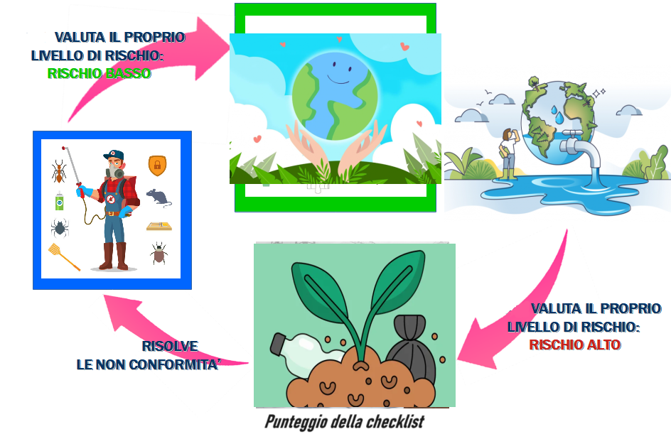
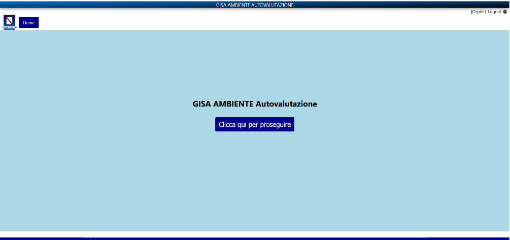
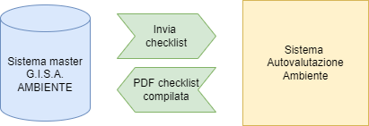
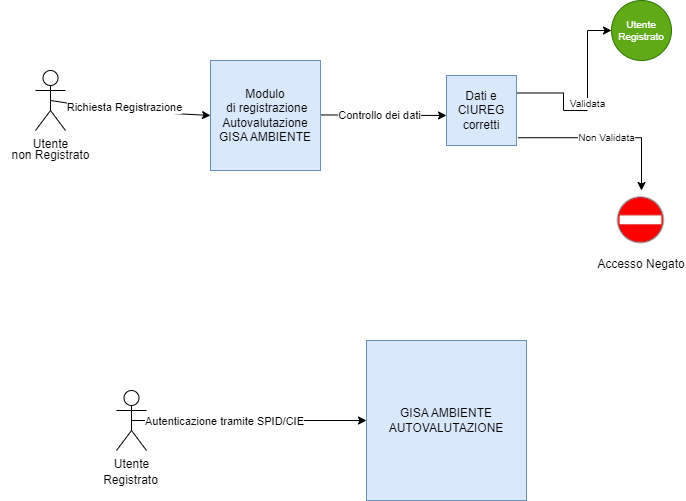

<p align="center">

</p>

# AUTOVALUTAZIONE AMBIENTE
- [1. Descrizione e finalità del software](#1-descrizione-e-finalità-del-software)
  - [1.1 Descrizione della struttura repository](#11-descrizione-della-struttura-repository)
  - [1.2 Contesto di utilizzo e casi d’uso](#12-contesto-di-utilizzo-e-casi-duso)
  - [1.3 Piattaforme abilitanti](#13-piattaforme-abilitanti)
  - [1.4 Interoperabilità con i sistemi esterni](#14-interoperabilità-con-i-sistemi-esterni)
  - [1.5 Link a pagine istituzionali relative al progetto](#15-link-a-pagine-istituzionali-relative-al-progetto)
  - [1.6 Interfaccia web](#16-interfaccia-web)
- [2. Architettura del software](#2-architettura-del-software)
- [3. Requisiti](#3-requisiti)
  - [3.1 Tecnologie utilizzate lato server](#31-tecnologie-utilizzate-lato-server)
  - [3.2 Tecnologie utilizzate lato client](#32-tecnologie-utilizzate-lato-client)
- [4. Riuso ed installazione](#4-riuso-ed-installazione)
  - [4.1 Build dai sorgenti](#41-build-dai-sorgenti)
  - [4.2 Riuso nell’ambito della stessa regione](#42-riuso-nellambito-della-stessa-regione)
  - [4.3 Riuso per enti di altre regioni](#43-riuso-per-enti-di-altre-regioni)
  - [4.4 Librerie esterne](#44-librerie-esterne)
  - [4.5 Creazione e import database](#45-creazione-e-import-database)
  - [4.6 Templates configurazione](#46-templates-configurazione)
  - [4.7 Installazione in un ambiente di sviluppo](#47-Installazione-in-un-ambiente-di-sviluppo)
  - [4.8 Installazione in un ambiente di produzione](#48-Installazione-in-un-ambiente-di-produzione)
- [5. Licenza](#5-licenza)
  - [5.1 Autovalutazione](#51-autovalutazione)
  - [5.2 Indirizzo e-mail segnalazioni di sicurezza](#52-indirizzo-e-mail-segnalazioni-di-sicurezza)
  - [5.3 Titolarità: Regione Campania](#53-titolarità-regione-campania)

# **1. Descrizione e finalità del software**


L'**Autovalutazione**  per Utenti registrati è un utile strumento per impianti autorizzati AUA col fine di
migliorare la conduzione del proprio impianto. L’accesso come ospite all’Autovalutazione può
essere utile a coloro che hanno intenzione di avvicinarsi alla consultazione dell’applicativo. Quindi,
quando viene cliccato “Accesso come Ospite” non c’è bisogno di registrarsi ma si accede
direttamente alla piattaforma.





Questo strumento è stato riconosciuto come **best-practice** dall'**OCSE - Organizzazione per la cooperazione e lo sviluppo economico** ed è innanzitutto, una guida all'autovalutazione, che aiuterà gli impianti a osservarsi, monitorarsi e valutarsi dandosi degli obiettivi di miglioramento [(OECD Report)](https://sca.gisacampania.it/qualita_ocse/OECD_report.pdf).


Il sistema è in grado di integrarsi e cooperare con tutti i componenti di GISA Ambiente. 
Inoltre prevede due livelli di accesso:

  1. **tramite SPID/CIE:** per gli OSA/FBO ovvero coloro che sono già in possesso di una attività

  2. **come ospite:** L’accesso come ospite all’Autovalutazione può essere utile a coloro che hanno intenzione di avvicinarsi alla consultazione dell’applicativo.

In entrambi i casi l’utente può compilare e stampare una o più checklist per linea di attività.
Il sistema è conforme al piano di prevenzione nazionale nell’ottica dell’autoconsapevolezza degli IMPIANTI.


Questo il link diretto al portale:
https://gisaambiente-coll.regione.campania.it/index


Il sistema **Autovalutazione** fa parte di GISA Ambiente.


## **1.1 Descrizione della struttura repository**

  - _./database_   script sql per la creazione della struttura del DB 

  - _./docs_       documentazione varia (cartella contenente file integrati nel readme: immagini, diagrammi, ecc.)  

  - _./templates_   file template per la configurazione del sistema

  - _./autovalutazione_    sorgenti e struttura di cartelle della piattaforma 


## **1.2 Contesto di utilizzo e casi d’uso**

 Il contesto di utilizzo e casi d'uso del Software sono descritti dettagliatamente nella [guida utente](https://gisaambiente-coll.regione.campania.it/moduloSpidAmb/doc/Manuale_autovalutazione.pdf)
 
## **1.3 Piattaforme abilitanti**

Le piattaforme abilitanti sono:
    - **Autenticazione SPID/CIE**
	
## **1.4 Interoperabilità con i sistemi esterni**

1. **SPID / CIE – Regione Campania**
	
La cooperazione applicativa con i sistemi esterni avviene mediante web services di tipo **SOAP** e **REST**.

La cooperazione applicativa interna di GISA Sicurezza alimentare e veterinaria avviene invece mediante **microservices** o **DBI (DataBase Interface)**.

## **1.5 Link a pagine istituzionali relative al progetto**

- [GISA AMBIENTE Autovalutazione](https://gisaambiente-coll.regione.campania.it/gisarpac/)

## **1.6 Interfaccia web**

Autovalutazione è dotato di un interfaccia web semplice ma molto dettagliata.
Questa la HOME: 




Figura 5. Rappresentazione della Home di Autovalutazione


# **2. Architettura del software**

L'architettura software cioè l'organizzazione di base del sistema, espressa dalle sue componenti, dalle relazioni tra di loro e con l'ambiente, e i principi che ne guidano il progetto e l'evoluzione.





Figura 6. Schema sull'interazione tra G.I.S.A Ambiente(sistema master) ed Autovalutazione





Figura 7. Organizzazione di base di GISA Ambiente


# **3. Requisiti**

## **3.1 Tecnologie utilizzate lato server**
 - [golang  >= 1.12](https://go.dev/dl/go1.18.linux-amd64.tar.gz)
 - [Postgres  12.x ](https://computingforgeeks.com/how-to-install-postgresql-12-on-centos-7/)
 - [Postgres Contrib](https://www.postgresql.org/docs/current/contrib.html)
 - [javascript jquery](https://jquery.com/)
 - [css bootstrap](https://getbootstrap.com/)
 - [git](https://www.digitalocean.com/community/tutorials/how-to-install-git-on-centos-7)
 
## **3.2 Tecnologie utilizzate lato client**
- [Windows](https://www.microsoft.com/it-it/software-download/) (dalla versione 10 in poi)
- **Portatile** e **Responsive** per il mobile.


 
 

# **4. Riuso ed installazione**

## **4.1 Build dai sorgenti**

Tecnicamente **Autovalutazione** è un'applicazione in architettura web sviluppata con linguaggio GO secondo il pattern _MVC_ (model view controller).

Come le applicazioni di questo genere Autovalutazione è quindi composta da un back-end in funzione di _Model_ (in questo caso l'_RDBMS_ Postgresql) 
una serie di risorse di front-end web (pagine _HTML_, _CSS_, immagini, ecc.) in funzione di _View_
e infine, in funzione di _Controller_, il linguaggio _GO_, con il suo framework _Iris_.  

 
## 4.2 Riuso nell’ambito della stessa regione

Nell’ottica del risparmio e della razionalizzazione delle risorse è opportuno che gli enti che insistono sullo stesso territorio regionale utilizzino la modalità **Multi-Tenant** al fine di installare un unico sistema a livello regionale.


## **4.3 Riuso per enti di altre regioni**
Al fine di avvalersi dei benefici del riuso così come concepito dal **CAD** si chiede di notificarlo come indicato nel paragrafo 5.3 al fine di evitare sprechi e frammentazioni.

*Nota: Se lo scopo è avviare un processo di sviluppo per modificare la propria versione di Autovalutazione, potrebbe essere il caso di generare prima un proprio fork su GitHub e quindi clonarlo.*

Eseguire il seguente comando:
	
		git clone \
		--depth 1 \
		--filter=blob:none \
		--sparse \
		https://github.com/regione-campania/Gisa_Campania_Ambiente \
		cd Gisa_Campania_Ambiente/
		git sparse-checkout set Gisa_Campania_Ambiente/gisa_ambiente_autovalutazione

Sarà creata la directory gisa_ambiente_autovalutazione. Da qui in avanti si farà riferimento a questa directory chiamandola "directory base".


## **4.4 Librerie esterne**

Le seguenti librerie sono autocontenute ma comunque eventualmente reperibili ai seguenti link:

 - [bootstrap 5.0.0](https://cdn.jsdelivr.net/npm/bootstrap@5.0.0-beta3/dist/js/bootstrap.bundle.min.js)
 - [jquery 3.6.0](https://code.jquery.com/jquery-3.6.0.min.js)
 - [jquery-ui](https://code.jquery.com/ui/1.13.0/jquery-ui.js)
 
 Queste invece sono automaticamente installate in ambiente GO alla prima compilazione:
 
 - [gorm](https://github.com/jinzhu/gorm)
 - [iris](https://github.com/kataras/iris)
 - [go-wkhtmltopdf](https://github.com/SebastiaanKlippert/go-wkhtmltopdf)


## **4.5 Creazione e import database**


Assicurarsi che nel file di configurazione pg_hba.conf sia correttamente configurato l'accesso dell'IP del nodo Tomcat al database: 
```
 host         all         all       <ipapplicativo>       trust
```
```
systemctl reload postgresql-12.service
```

Creazione Database e import dello schema tramite i seguenti comandi, con _dbuser_ e _dbhost_ adeguatamente valorizzati :

```
psql -U <dbuser> -h <dbhost> -c "create database autovalutazione "
```

Posizionarsi nella directory _gisa_ambiente_autovalutazione_ ed eseguire il comando: 

```
psql -U <dbuser> -h <dbhost> -d autovalutazione < database/autovalutazione.sql
```

Per configurare il database Autovalutazione da cui recuperare le checklist bisogna inserire un record nella tabella _public.config_. Eseguire i seguenti comandi:
```
psql -U <dbuser> -h <dbhost> -d autovalutazione -c "truncate table public.config"
```
```
psql -U <dbuser> -h <dbhost> -d autovalutazione -c "INSERT INTO public.config (host, dbname, \"user\", "password", port) VALUES ('<dbhost_gisa>', '<dbname_gisa>', '<dbuser_gisa>', '<dbpassword_gisa>', '<dbport_gisa>');"

```

Sostituendo ai parametri da inserire i giusti valori.


## **4.6 Templates configurazione**

Sotto la directory _./templates_ è presente il file template _./templates/config.json , da configurare ed inserire sotto la directory _./gisa_ambiente_autovalutazione/config/

la directory config deve essere creata con il comando: 

```
mkdir autovalutazione/config
```


## **4.7 Installazione in un ambiente di sviluppo**

- Installare _Visual_  _Studio_ _Code_ disponibile al seguente indirizzo: https://code.visualstudio.com/

oppure

- Installare _Notepad++_ disponibile al seguente indirizzo: https://notepad-plus-plus.org/downloads/

- Le istruzioni per l'installazione di un ambiente di sviluppo sono le stesse della procedura di installazione ambiente di produzione.


## **4.8 Installazione in un ambiente di produzione**

Prerequisiti:

-Clonare il repository AUTOVALUTAZIONE (Vedi paragrafo: 4.3 Riuso per enti di altre regioni):


		
		git clone 
		--depth 1 
		--filter=blob:none 
		--sparse 
		https://github.com/regione-campania/Gisa_Campania_Ambiente 
		;
		cd Gisa_Campania_Ambiente/
		git sparse-checkout set  Gisa_Campania_Ambiente/gisa_ambiente_autovalutazione

-Creare ed importare database (Vedi paragrafo: Creazione e import database )

-Configurare i templates (Vedi paragrafo: Templates configurazione)


Installazione:


- [Installazione e configurazione ambiente go](https://go.dev/doc/install)

- Creazione dell'alberatura consigliata per progetti GO _$HOME/go_projects/src_

- Spostare la directory gisa_ambiente_autovalutazione
  
```
 cd gisa_ambiente_autovalutazione
```

```
chmod +x build.sh
```

```
./build.sh
```
```
 ./run.sh
```
  Al termine della compilazione il file eseguibile sarà nella directory _bin_ 


# **5. Licenza**

## **5.1 Autovalutazione**

Stato Software : In sperimentazione


**Soggetti incaricati del mantenimento del progetto open source**

U.S. s.r.l. 
## **5.2 Indirizzo e-mail segnalazioni di sicurezza**
Ogni segnalazione di eventuali problemi di sicurezza o bug relativo al software presente in questo repository, va segnalato unicamente tramite e-mail agli indirizzi presente nel file security.txt disponibile a questo [link](http://gisa.regione.campania.it/.well-known/security.txt)

NOTA: Le segnalazioni non vanno inviate attraverso l’issue tracker pubblico ma devono essere inviate confidenzialmente agli indirizzi e-mail presenti nel security.txt.

Lo strumento issue tracker può essere utilizzato per le richieste di modifiche necessarie per implementare nuove funzionalità.

## **5.3 Titolarità: [Regione Campania](http://www.regione.campania.it/)**
Concesso in licenza a norma di: **AGPL versione 3**;

E' possibile utilizzare l'opera unicamente nel rispetto della Licenza.

Una copia della Licenza è disponibile al seguente indirizzo: <https://www.gnu.org/licenses/agpl-3.0.txt>

**NOTE:**

In caso di riuso, in toto o in parte di GISA Ambiente, è necessario notificare l’adozione in riuso tramite l’apertura di un ticket (o analogo meccanismo quale una pull request) in questo repository. Inoltre, al contempo per gli aspetti organizzativi utili a potenziare i benefici derivanti dalla pratica del riuso tra PP.AA., come la partecipazione al **Centro di competenza e di supporto al riuso e al ciclo di vita del software GISA Campania** per la condivisione di eventuali modifiche/integrazioni o innovazioni, è necessario darne tempestiva comunicazione alle seguenti e-mail:

[cinzia.matonti@regione.campania.it]()	

[mt.filazzola@arpacampania.it]() 

[r.belluomo@arpacampania.it]() 

Gli enti che aderiscono al riuso di GISA entreranno a far parte del "Centro di competenza e di supporto al riuso e al ciclo di vita del software GISA Campania" per condividere e partecipare all’evoluzione di GISA insieme alle altre PP.AA.